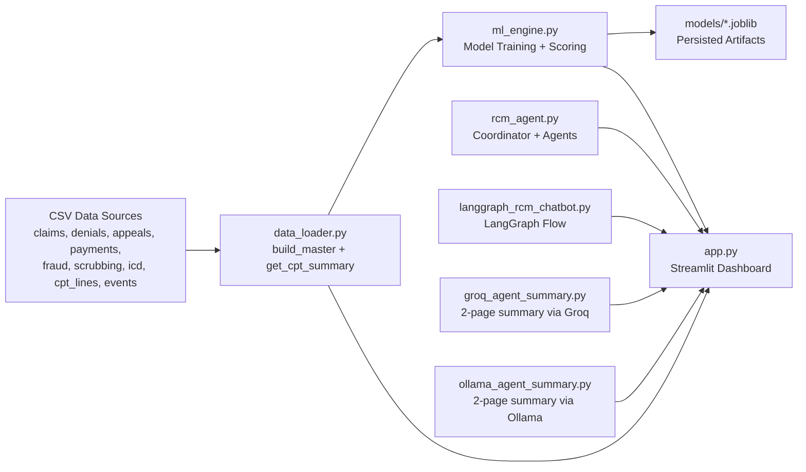
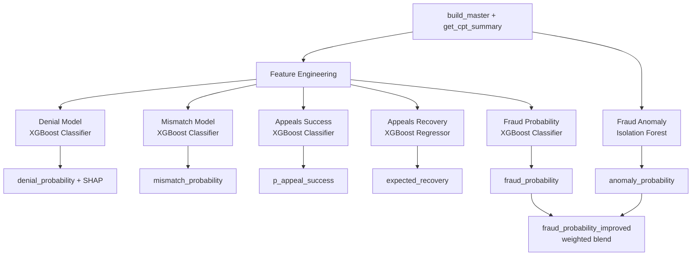
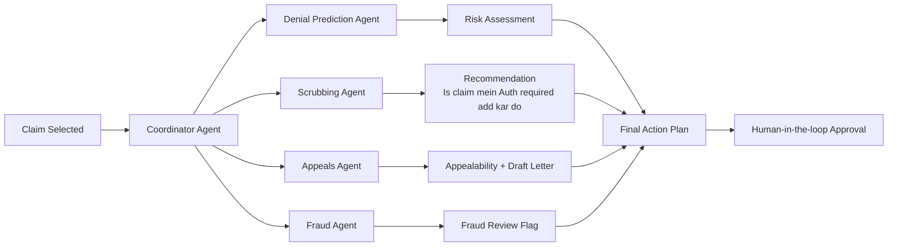
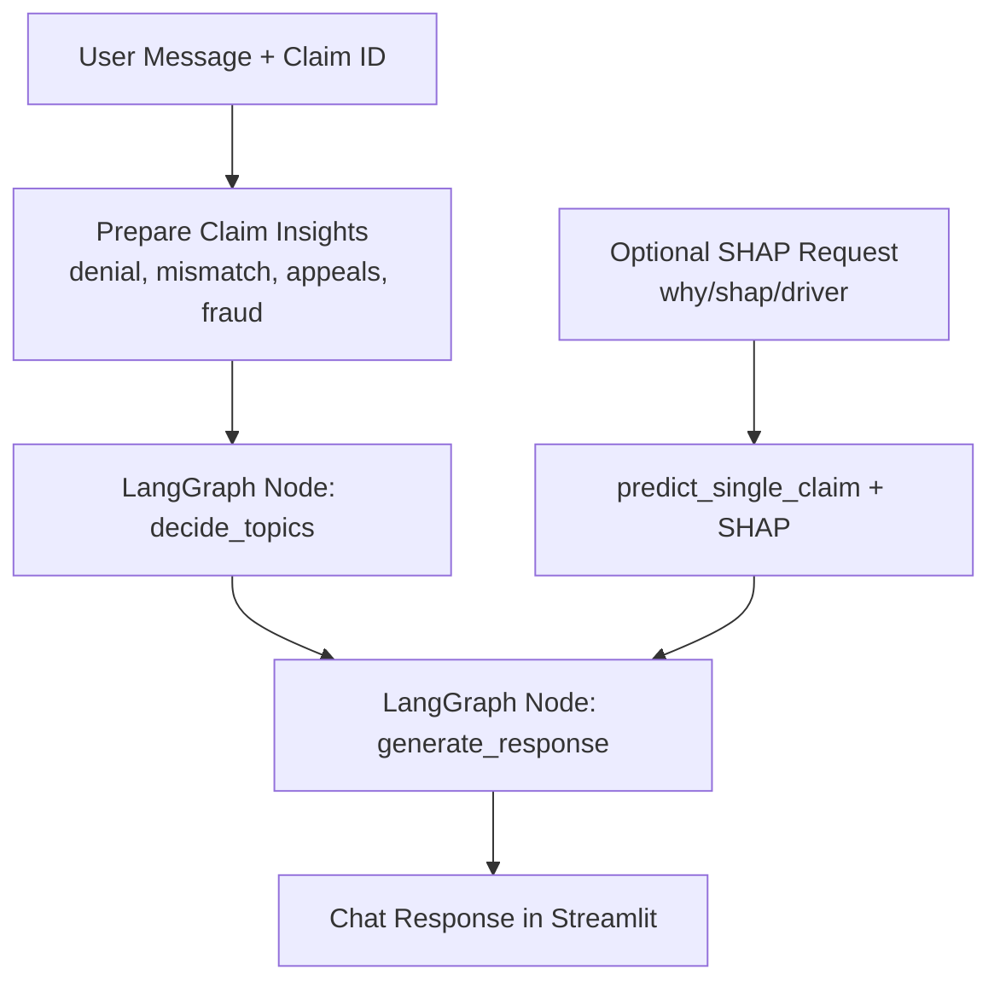

# AI-Powered Smart RCM Prototype

This repository contains a Streamlit-based Revenue Cycle Management (RCM) prototype with:

- Predictive denial modeling (XGBoost + SHAP)
- Smart claim scrubbing (CPT-ICD mismatch probability + recommendation)
- Appeals prioritization (success probability + expected recovery)
- Fraud enhancement (supervised fraud probability + Isolation Forest anomaly signal)
- Agentic workflow demo (coordinator + specialized agents)
- LangGraph chatbot for claim-level conversational insights
- Groq/Ollama-based 2-page summary generation for demo artifacts

---

## Prototype Architecture



---

## ML Pipeline (Training + Inference)



---

## Agentic Workflow (Prototype)



---

## LangGraph Chatbot Flow



---

## Main Application Pages

- Executive Summary
- Denial Intelligence
- Appeals Analytics
- Fraud Detection
- Smart Scrubbing
- AR Aging & Lifecycle
- AI Denial Predictor
- Agentic RCM Agent (Demo)
- LangGraph Chatbot (Demo)

---

## Run Locally

```bash
python3 -m venv venv
source venv/bin/activate
pip install -r requirements.txt
streamlit run app.py
```

### Optional: React UI Prototype (No Node Required)

A polished React-based no-build UI is available in `frontend/` for presentation/demo.

Run:

```bash
python3 backend_api.py
```

API endpoints:
- `GET /api/health`
- `GET /api/summary`
- `GET /api/agent/claim/<claim_id>`

In another terminal:

```bash
cd frontend
python3 -m http.server 8080
```

Then open:

- http://localhost:8080

---

## Notes

- This is a prototype/demo implementation.
- Models are trained from CSV datasets in `data/` and persisted in `models/`.
- Summary generation supports:
  - Groq (`GROQ_API_KEY` required)
  - Ollama (local server required)
