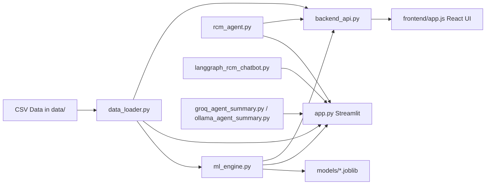
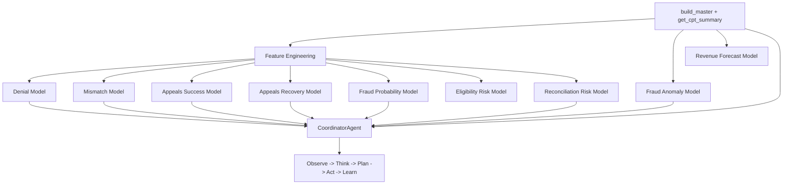

# AI-Powered Smart RCM Prototype

AI-powered Revenue Cycle Management prototype with Streamlit dashboard, ML models, agentic claim orchestration, LangGraph chatbot, and a React demo UI.

## What Is Implemented

- Predictive denial intelligence (`XGBoost` + SHAP explainability)
- Smart claim scrubbing (`CPT-ICD` mismatch risk + recommendations)
- Appeals prioritization (success probability + expected recovery estimate)
- Fraud enhancement (supervised risk + `IsolationForest` anomaly blending)
- Patient access and eligibility risk scoring
- Payment reconciliation risk scoring
- Revenue trend forecasting and what-if style exploration
- Agentic workflow (`CoordinatorAgent` + specialized agents)
- LangGraph claim-level chatbot in Streamlit
- 2-page narrative summary generation via Groq or Ollama
- Lightweight Python backend API + React (no-build CDN) UI

---

## Repository Components

- `app.py` - Main Streamlit dashboard
- `ml_engine.py` - Model train/load/score pipeline
- `data_loader.py` - CSV loading + feature preparation
- `rcm_agent.py` - Coordinator and specialist agents
- `langgraph_rcm_chatbot.py` - LangGraph claim chatbot flow
- `custom_coding_agent.py` - CPT/ICD coding recommendation logic
- `clinical_nlp_agent.py` - Clinical note to ICD prediction support
- `groq_agent_summary.py` - Groq-based 2-page summary generation
- `ollama_agent_summary.py` - Ollama-based 2-page summary generation
- `backend_api.py` - API for React dashboard
- `frontend/` - React dashboard prototype (served as static files)

---

## Architecture



---

## ML and Agent Flow



---

## Dashboard Pages (Streamlit)

- Executive Summary
- Patient Access & Eligibility
- Denial Intelligence
- Appeals Analytics
- Fraud Detection
- Smart Scrubbing
- Payment Reconciliation
- Revenue Forecasting
- Monitoring & Alerts
- AR Aging & Lifecycle
- Agentic RCM Agent
- LangGraph Chatbot
- AI Denial Predictor

---

## Setup

### 1) Create environment and install dependencies

```bash
python3 -m venv venv
source venv/bin/activate
pip install -r requirements.txt
```

### 2) Configure optional environment variables

Create or update `.env` in project root:

```env
# Groq (optional)
GROQ_API_KEY=""
GROQ_MODEL=llama-3.3-70b-versatile

# Ollama (optional)
OLLAMA_MODEL=llama3:8b
```

`app.py` loads this automatically using `python-dotenv`.

---

## Run the System

### Option A: Main Streamlit application (recommended)

```bash
source venv/bin/activate
streamlit run app.py
```

Open the URL shown by Streamlit (usually `http://localhost:8501`).

### Option B: React demo UI with backend API

Run backend API:

```bash
source venv/bin/activate
python3 backend_api.py
```

In another terminal, serve frontend:

```bash
cd frontend
python3 -m http.server 8080
```

Open `http://localhost:8080`.

If you serve from project root, `index.html` redirects to `frontend/index.html`.

---

## API Endpoints

From `backend_api.py`:

- `GET /api/health`
- `GET /api/summary`
- `GET /api/agent/claim/<claim_id>`
- `POST /api/score-claim`

Base URL: `http://localhost:8001`

### Realtime single-claim inference (no CSV append needed)

Use `POST /api/score-claim` to score a new incoming claim payload and run `CoordinatorAgent`.

Example:

```bash
curl -X POST "http://localhost:8001/api/score-claim" \
  -H "Content-Type: application/json" \
  -d '{
    "claim_id": 990001,
    "encounter_id": 880001,
    "patient_id": 770001,
    "insurance": "Aetna",
    "visit_type": "OP",
    "icd_code": "E11.9",
    "gender": "F",
    "age": 54,
    "claim_amount": 1850,
    "paid_amount": 0,
    "fraud_score": 0.32,
    "denial_reason": "Auth required",
    "is_denied": true,
    "is_appealed": false,
    "appeal_success": false,
    "cpt_codes": ["99213", "80053"],
    "total_cpt_amount": 1750,
    "clinical_notes": "Diabetes follow-up, lab review, medication adjustment."
  }'
```

---

## LLM Summary Generation

In Streamlit (`Agentic RCM Agent` page):

- **Groq summary**: requires `GROQ_API_KEY`
- **Ollama summary**: requires local Ollama server running

Example Ollama run command:

```bash
ollama serve
```

---

## Notes

- This is a prototype focused on demoability and extensibility.
- Models are trained from local CSV data and persisted under `models/`.
- If model files are missing, training is triggered automatically in relevant flows.
