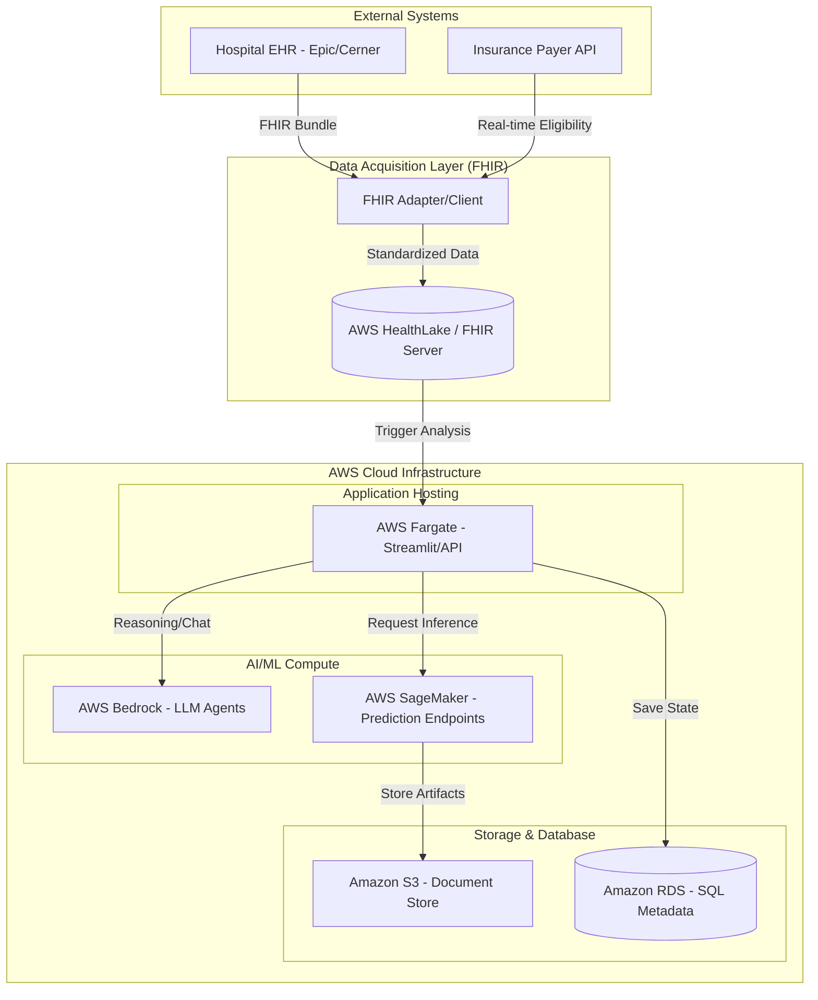

# Architecture Roadmap: AI-Powered Smart RCM

This document outlines the strategic evolution of the RCM Prototype from a local demonstration into a production-grade, cloud-native platform.

## Future State Architecture

The following diagram illustrates the integration of **FHIR** for data standardization and **AWS** for scalable, secure processing.

---

## Roadmap Phases

### Phase 1: Cloud Founding (Transition to AWS)
*   **Hosting**: Migrate the Streamlit dashboard and Python API to **AWS Fargate** or **App Runner**.
*   **Inference**: Deploy existing XGBoost and Isolation Forest models to **AWS SageMaker** real-time endpoints.
*   **Security**: Implement **AWS IAM** for role-based access control and **AWS KMS** for data encryption at rest.

### Phase 2: Data Interoperability (FHIR Integration)
*   **FHIR Client**: Develop a Python-based FHIR client using the `fhir.resources` library.
*   **ETL Pipeline**: Build a transformation layer to convert FHIR `Claim` and `ExplanationOfBenefit` resources into feature vectors for the ML models.
*   **Integration**: Connect to a mock FHIR server (e.g., HAPI FHIR) to simulate real-time EHR data flow.

### Phase 3: Enterprise AI (AWS Bedrock & Agents)
*   **Foundation Models**: Replace local LLMs with **AWS Bedrock** (using Claude 3.5 or Llama 3) for superior reasoning and summarization.
*   **Agentic Workflows**: Enhance the `CoordinatorAgent` with **LangGraph** persistence stored in **Amazon DynamoDB**.
*   **Scalability**: Use **SageMaker Multi-Model Endpoints** to manage different model versions for different payers or hospital specialties.

### Phase 4: Full Automation & FHIR Hooks
*   **FHIR Hooks**: Implement `CDS Hooks` to trigger the RCM analysis directly from the doctor's workflow in the EHR.
*   **Automated Appeals**: Fully automate the submission of appeal letters via Payer Portals or EDI 275 transactions.
*   **Predictive Analytics**: Expand into "What-if" revenue forecasting using **Amazon Forecast**.
